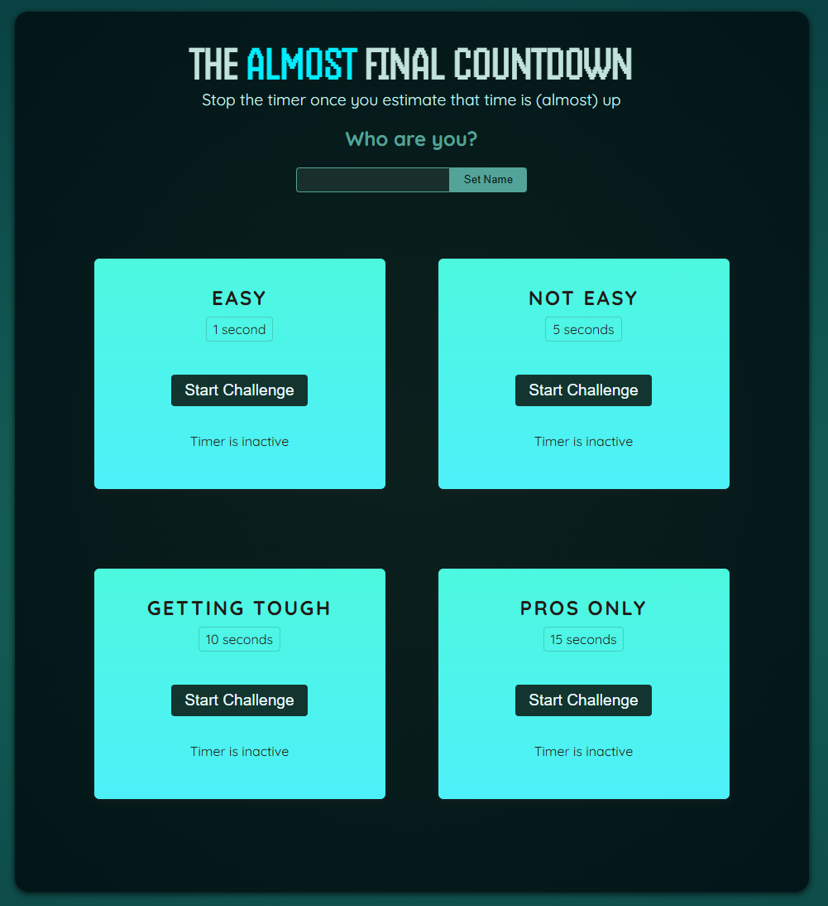
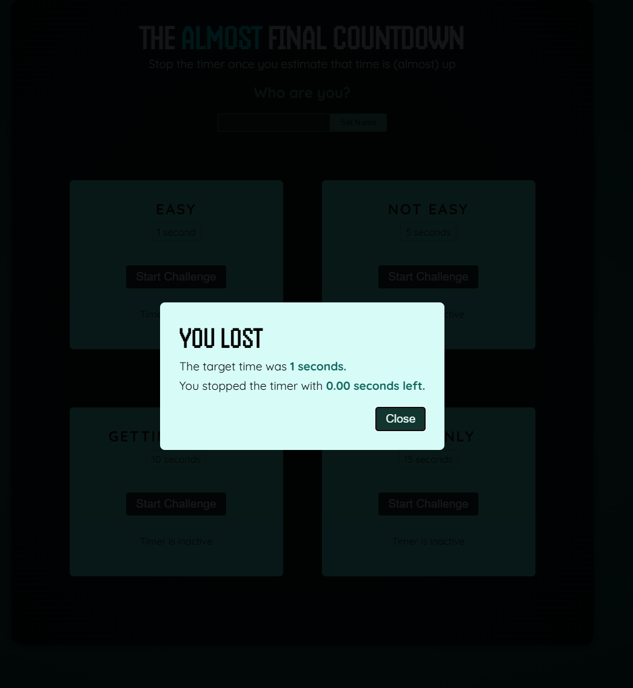

# Timer Game

Welcome to the **Timer Game**! This project is a simple and interactive game designed for educational purposes. It serves as a hands-on example to learn React and related web development concepts.

## Features
- **Timer Challenge**: Test your timing skills with an engaging timer-based challenge.
- **Player Component**: Interactive player functionality.
- **Result Modal**: Displays results in a user-friendly modal.

## Technologies Used
- **React**: A JavaScript library for building user interfaces.
- **Vite**: A fast build tool for modern web projects.
- **CSS**: For styling the application.

## Getting Started
Open your browser and navigate to https://gudratli-timer.netlify.app to view the application.

### Screenshots from the Application

Happy coding! 🚀
